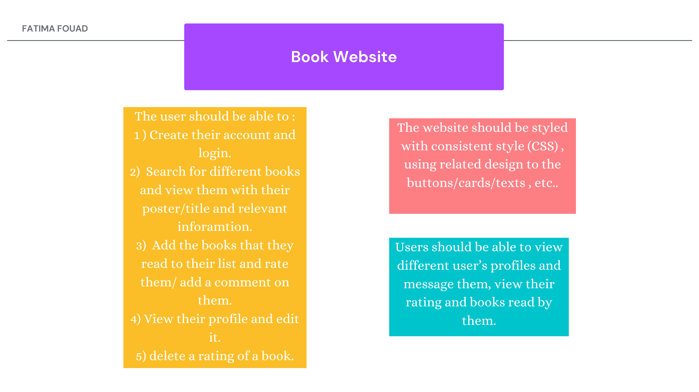
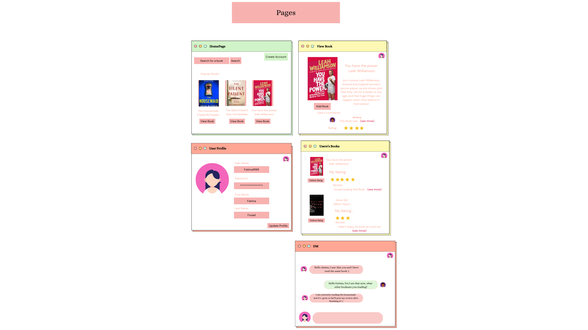
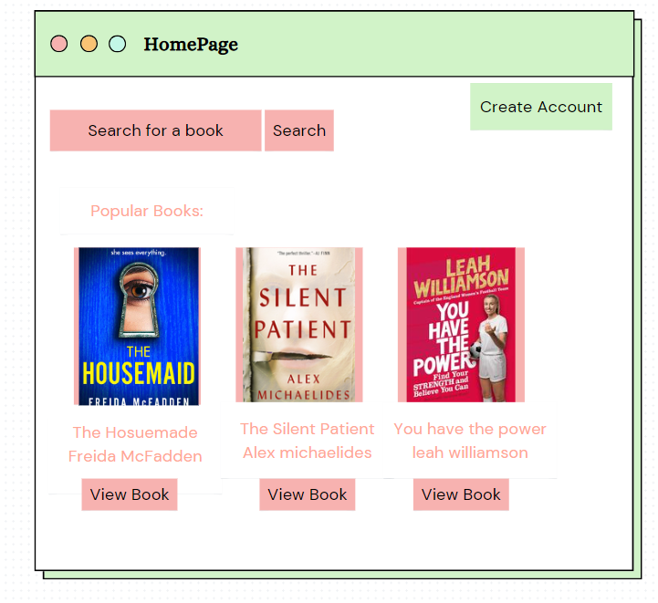
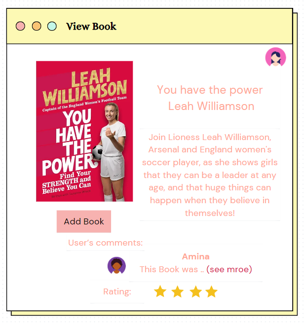
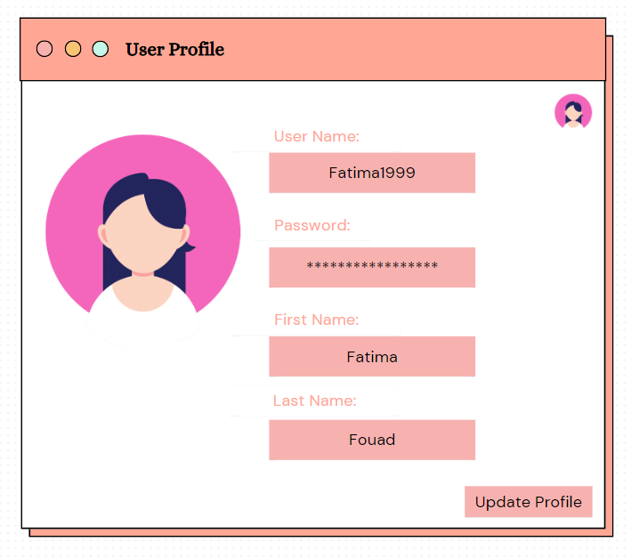
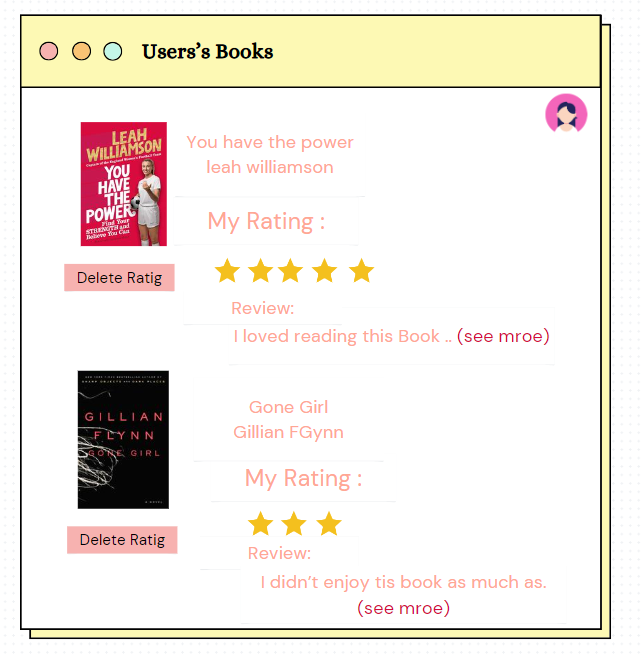
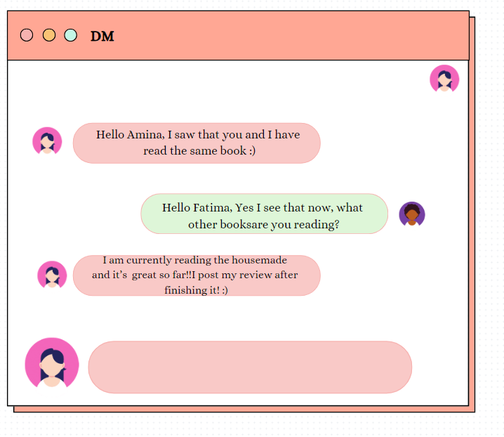

# BookStore

## Date Created: 10/11/24
### Made By : Fatima Fouad
---
### **_Description_**

#### This Website is an online book store where users can create their own accounts, search for books, rate and add comments about the books they have read , and view other user's rating, wiht the addition of Direct messaging other users.
---

###  Screenshots:
## Early Design:
### - Early Functionality roadmap:
## 

### Pages:
<table>
  <tr>
    <td></td>
    <td></td>
    <td></td>
  </tr>
  <tr>
    <td></td>
    <td></td>
    <td></td>
  </tr>
</table>
---

### Technologies used

- [x]OutSystems

  
### Download Website OverView Video "Demo":
- [Demo](booklycompressed.mp4) .
---
### What I have learned:

- [x] How to use multuple API's in OutSystems.
- [x] How To Use Chat Messages in OutSysteems.
- [x] How to use diffrent aggregates and logic in OutSystems. 
---
### What I am most proud of :

```
  The API and how I used it, I have tried for 2 days and I had diffrent problems with the image showing for each book or each author so it took sime time to create the logic behind it.

```
### Future Plans:
- [ ] Improve the UI.
- [ ] Add more functionalities.
---
### Credits:
- [Open Library](https://openlibrary.org/dev/docs/api/search)
- [OutSystems](https://www.outsystems.com/)
---
### Linkdin :
[linkdin](https://www.linkedin.com/in/fatima-fouad-29626312a)
